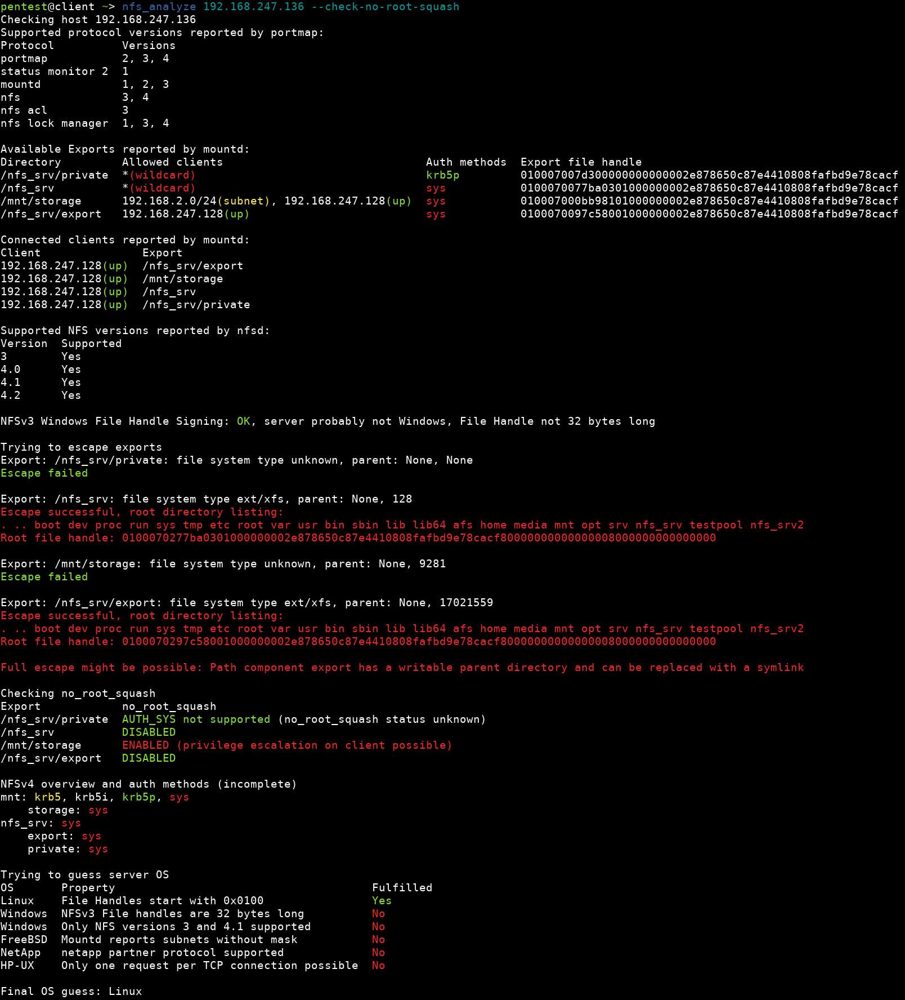

This repository contains two tools, `nfs_analyze` and `fuse_nfs` that are released along with our [blog post](https://www.hvs-consulting.de/TODO) on the NFS protocol from a pentester's perspective.

These tools are designed for and tested on Linux. 
To install, first make sure pkg-config, libfuse3-dev and python3-dev are installed.
For example, on Kali you can run 

~~~
sudo apt update
sudo apt install pkg-config libfuse3-dev python3-dev
~~~

to install the dependencies.
Afterwards, you can install `nfs_analyze` and `fuse_nfs`, for example with [pipx](https://github.com/pypa/pipx), using:

~~~
pipx install git+https://github.com/hvs-consulting/nfs-security-tooling.git
~~~

The programs require cap_net_bind_service or root privileges to use privileged ports. On Kali this should work automatically because it does not have privileged ports, on other systems you may have to install and run the program as root or temporarily disable privileged ports by running ```sudo sysctl net.ipv4.ip_unprivileged_port_start=0```.

# nfs_analyze
This script prints details about an NFS server and detects some potential misconfigurations which are highlighted in red.
It is based on a [modified version of pynfs](https://github.com/hvs-consulting/pynfs).

**WARNING**: *This script leaves traces in logs and the rmtab on the server.*

```
usage: nfs_analyze [-h] [--check-no-root-squash] [--btrfs-subvolumes BTRFS_SUBVOLUMES] [--delay DELAY] [--timeout TIMEOUT] [--skip-version-check] [--no-color] [--no-ping] [--ping-timeout PING_TIMEOUT] [--v4-overview-depth V4_OVERVIEW_DEPTH] [--v4-show-exports-only] [--charset CHARSET] [--json-file JSON_FILE] [--json-dir JSON_DIR] [--findings-file FINDINGS_FILE] [--verbose-errors] [--reload-pynfs] [target ...]

positional arguments:
  target                List of targets, each target can be an IP address, a hostname or a path to a file containing a host on each line (default: None)

options:
  -h, --help            show this help message and exit
  --check-no-root-squash
                        Test if no_root_squash is enabled on the server which can be used for privilege escalation on clients. WARNING: THIS WRITES DATA ON THE SERVER (default: False)
  --btrfs-subvolumes BTRFS_SUBVOLUMES
                        Number of subvolumes to try to read when escaping a BTRFS export (default: 16)
  --delay DELAY         Number of milliseconds to wait between connections. If this value is too low, connections might fail (default: 1000)
  --timeout TIMEOUT     Socket timeout in milliseconds (default: 3000)
  --skip-version-check  Skip version check to speed up the test (default: False)
  --no-color            Disable colored output (default: False)
  --no-ping             Do not ping clients reported by mount (default: False)
  --ping-timeout PING_TIMEOUT
                        Number of seconds before a ping times out (default: 1)
  --v4-overview-depth V4_OVERVIEW_DEPTH
                        Depth of directory tree in NFSv4 overview (default: 2)
  --v4-show-exports-only
                        Only show export root directories in the NFSv4 overview. Only works on Linux servers, does not show nested exports (default: False)
  --charset CHARSET     charset used by the server (default: utf-8)
  --json-file JSON_FILE
                        Output to a single json file (default: None)
  --json-dir JSON_DIR   Output to one json file per host in given directory (default: None)
  --findings-file FINDINGS_FILE
                        Output a short summary of findings to a json file (default: None)
  --verbose-errors      Verbose error logging (default: False)
  --reload-pynfs        Reload pynfs after every host (default: False)
```

## Input and Output format
A list of targets has to be provided. Each target can be an IP address, a hostname or a path to a file containing a host on each line.

Colored human-readable output is printed to the terminal, the colors can be disabled using the `--no-color` option.
There are three parameters to generate machine-readable output.
The most interesting one is `--findings-file` which provides a JSON containing an overview of all mountable exports and detected misconfigurations.
The `--json-file` parameter outputs verbose information on all performed checks to one file.
The `--json-dir` option is the same but it creates a file for each host in the given directory.
Any combination of the three output options can be used.

## Checks
The script performs the following checks:

### Supported protocols
This check shows all supported protocols reported by portmap.
If this doesn't show anything, the server might be configured to only support NFSv4 which doesn't need portmap.

### NFSv3 exports
This is an overview of all available NFSv3 exports, allowed clients, authentication methods and export file handles.
Only the authentication methods available to the current host are listed. Exports can be configured to allow different authentication methods for different hosts.
If nothing is shown, it could mean, that the server only supports NFSv4.

### Clients connected to the NFS server
This is an overview of all clients connected to the server.
This list may be inaccurate for the following reasons:
- NFSv4 clients are not shown
- If clients do not unmount the export properly, they will remain in the list even if they are not connected anymore
- If clients skip the mount protocol and communicate with NFS directly, they will not be listed
- The Windows NFS server implementation does not list any clients

### NFS versions supported by the server
This check shows if NFS version 3, 4.0, 4.1 and 4.2 are supported. Earlier NFS versions are not supported by this script.

If no version is reported, there could be multiple reasons:
- The server only supports old NFS versions
- The server only supports NFSv4 but on a port that is not 2049
- The server is not an NFS server

This check takes a long time because the script has to wait some time between each connection attempt.
Otherwise the server might return an error that the session is still open.
The delay between connection attempts can be set using the `--delay` option. The default value of 1000ms appears to be effective for Linux and Windows.
Disable this check when scanning many hosts and version information is not needed using the `--skip-version-check` option in order to speed up the process.

### Windows file handle signing
If an NFSv3 file handle looks like one from a Windows server, it checks if the last 10 bytes are 0 or not in order to determine if file handle signing is enabled.
If it is disabled, all files on the file system are accessible.

### Escape
If the file handle looks like one from a Linux server, it tries to list the root directory of the file system of each export.

This only works if all of the following conditions are met:
- The server uses Linux
- The export does not have the option `subtree_check` set in `/etc/exports`
- The export is stored on an `ext`, `xfs` or `btrfs` file system

If this check reports a successful escape, check the directory listing to see if this escape would give an attacker access to files that are not accessible otherwise.
If the directory listing contains the same entries that the export itself contains, the export is already the root of the file system and the escape has no effect.

The file handle of the file system root directory will be displayed. This file handle can be used by fuse_nfs to interact with the file system.

If the escape was sucessful, the check tries to read `/etc/shadow` using two methods:
1. use uid and gid 0 -> works if `no_root_squash` is set
2. if gid of `/etc/shadow` is not 0, use that gid -> works on SuSE and Debian based systems

The `/etc/shadow` can only be read if the export is on the same partition where the operating system is installed.

### no_root_squash
**WARNING:** *This creates a directory in each export and deletes it immediately afterwards. For this reason it has to be manually enabled using `--check-no-root-squash`*

This check only works if the export allows `AUTH_SYS` and if it is writable.
It creates a directory owned by root and checks if the creation is successful.

### Overview of files available via NFSv4
This check is useful if the server doesn't support NFSv3 and the first check doesn't show any exports

### Server OS guess
This check tries to guess the server OS by analyzing file handles, protocol versions and other unique properties of different operating systems.



# fuse_nfs
This is a fuse driver that can mount an NFS export. The advantage of this script compared to the normal mount command is that it autamatically sends the right uid and gid to the server to get access to as many files as possible. It is also able to mount an arbitrary file handle including file system root file handles found by nfs_analyze.
This tool is based on [anfs](https://github.com/skelsec/anfs).

## Required setup
Edit `/etc/fuse.conf` and uncomment the line `user_allow_other`

## Usage
```
usage: fuse_nfs [-h] (--export EXPORT | --manual-fh MANUAL_FH) [--uid UID | --fake-uid] [--fake-uid-allow-root] [--allow-write] [--remote-symlinks] [--unprivileged-port] [--fix-nested-exports] [--debug] [--debug-fuse] mountpoint host

positional arguments:
  mountpoint            Where to mount the file system
  host                  IP address of the host

options:
  -h, --help            show this help message and exit
  --export EXPORT       Path of export directory
  --manual-fh MANUAL_FH
                        Set a root file handle manually as a hex string
  --uid UID             Manualy set UID and GID number, format UID:GID
  --fake-uid            Automatically fake UID and GID to access more files
  --fake-uid-allow-root
                        Enable if no_root_squash is enabled on the export
  --allow-write         Allow writing
  --remote-symlinks     Follow symlinks on the server, not the client
  --unprivileged-port   Connect from a port >1024
  --fix-nested-exports  Make nested exports on NetApp servers work
  --debug               Enable debugging output
  --debug-fuse          Enable FUSE debugging output
```

When running this program, always provide exactly one of the options `--manual-fh` or `--export` to specify the export root.
The `--export`option allows you to mount an export just like the mount command. The `--manual-fh` option can be used to mount a file sytem root directory that nfs_analyze has found.

To stop the program, run ```umount mountpoint```. Also run this command when the program crashes and after interrupting it, otherwise there will be an error when starting it again on the same mountpoint.

By default only read operations are allowed. If you need to make changes to the server, use `--allow-write`.

Use one of the options `--uid` or `--fake-uid`. If you want to browse a share, `--fake-uid` is the right option. If no_root_squash is enabled, also enable the `--fake-uid-allow-root` option to get access to files owned by root. If you want to upload a file with a specific UID and GID for privilege escalation, you can manually specify them using the `--uid` option.
On the client side, the operating system's permission checks are bypassed by setting the permission bits for others to the permission bits of the owner and the group of the file while still showing the correct uid and gid of the file.
It does not matter which user account you use to access files on your machine.

The inode numbers in the file system are not related to the actual inode numbers on the server. They are assigned by the anfs library based on when the file handle has been seen for the first time.
